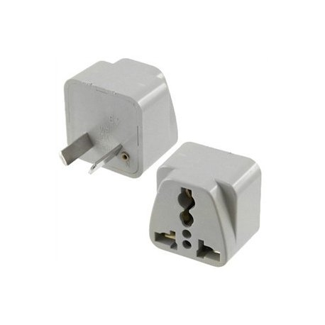
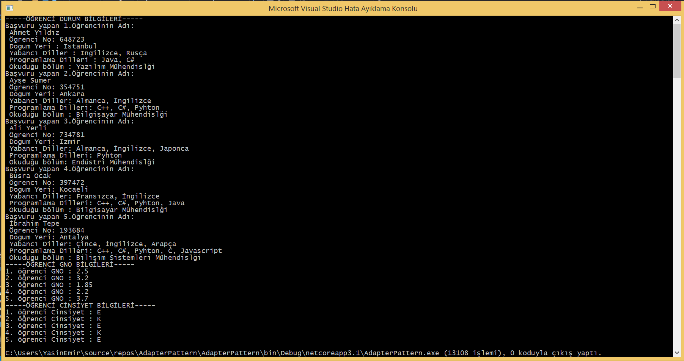

= Adapter Pattern UML 150202040 Yasin Emir Kutlu

== Adapter Pattern
*Adapter Design Pattern Nedir ?:* Yapısal gruba ait, Birbirleriyle uyumlu çalışmayan yapıların birbirleriyle uyumlu çalışır hale gelmesini sağlayan tasarım desenidir.Varolan yapıyı başka bir yapı ile sarmalar.

*Adapter Design Pattern Nasıl Kullanılır ? :* Interface türünde bir Target sınıfı, eklenecek olan modülü barındıran Adaptee sınıfı ve Adaptee sınıfını varolan yapıyla uyumlu hale getiren Adapter sınıfı son olarak ise Target Interface'i kullanan istemci (main) sınıfının oluşturulması gerekmektedir.

*Adapter Design Pattern'ın Neden Kullanılır ?:* Bazı durumlarda var olan sisteme farklı bir sınıf, kütüphane veya modül eklenmek istenebilir. Fakat işlemin gerçeklenebilmesi için bir uyum sağlama işlemi gereklidir. Bu tarz durumlarda yapıların birbirleriyle uyumlu çalışabilmesi için Adapter Design Pattern kullanılmaktadır.

*Adapter Design Pattern Kullanmanın Avantajları Nelerdir ?:* Birbirleriyle ilişkili olmayan yapıların birbirleriyle uyumlu çalışmasını sağlar. Varolan bir yapıya başka bir modülü,sınıfı veya kütüphaneyi uygulamamızı sağlar ve sistemi yeni modüller eklenebilir bir hale getirir.

== Adaptern Pattern UML Diyagramı

[plantuml,Adapter,png]
----
class Adapter
{

}
class Adaptee
{
+ OgrenciListeGetir () : List<string>
+ OgrenciGNOGetir () : List<string>
+ OgrenciCinsiyetGetir() : List<string>
}

Interface Hedef
{
+ StudentsFetch() : List<string>
+ GPAFetch() : List<string>
+ Gender () : List <string>
}

class Program
{
 + Hedef adapter 
 + Hedef adapter2
 + Hedef adapter3
 + {static} Main() : void
}

Adaptee <|.left. Adapter : <<extend>>
Hedef <|-down- Adapter : <<implement>>
Program -right- Hedef : <<request>>

----

== Kaynak Kodların Açıklanması

[source,C#]
----
 //Hedef.cs 
public interface Hedef <1>
    {
        public List<string> StudentsFetch();
        public List<string> GPAFetch();
        public List<string> Gender();
    }
    
 // Adapter.cs 
public class Adapter : Adaptee , Hedef <2>
    { 
        public List<string> StudentsFetch() <3>
        {
            return OgrenciListeGetir();
        }

        public List<string> GPAFetch()
        {
            return OgrenciGNOGetir();
        }

        public List<string> Gender()
        {
            return OgrenciCinsiyetGetir();
        }
    }

 //Adaptee.cs
 public List<string> OgrenciListeGetir() <4>
        {
            // Ogrencilerin bilgileri listeye eklenir
            List<string> OgrenciListe = new List<string>();
            OgrenciListe.Add(" Ogrencilerin bilgileri girilir. ")
            return OgrenciListe;
        }
 public List<string> OgrenciGNOGetir()
        {
            // Ogrencilerin GNO'ları listeye eklenir
            List<string> OgrenciGNO = new List<string>();
            OgrenciGNO.Add("1. öğrenci GNO : 2.5");
            OgrenciGNO.Add("2. öğrenci GNO : 3.2");
            OgrenciGNO.Add("3. öğrenci GNO : 1.85");
            OgrenciGNO.Add("4. öğrenci GNO : 2.2");
            OgrenciGNO.Add("5. öğrenci GNO : 3.7");
            return OgrenciGNO;

        }

        public List<string> OgrenciCinsiyetGetir()
        {
            // Ogrencilerin cinsiyeti listeye eklenir
            List<string> OgrenciCinsiyet = new List<string>();
            OgrenciCinsiyet.Add("1. öğrenci Cinsiyet : E");
            OgrenciCinsiyet.Add("2. öğrenci Cinsiyet : K");
            OgrenciCinsiyet.Add("3. öğrenci Cinsiyet : E");
            OgrenciCinsiyet.Add("4. öğrenci Cinsiyet : K");
            OgrenciCinsiyet.Add("5. öğrenci Cinsiyet : E");
            return OgrenciCinsiyet;

        }
 //Program.cs
 class Program 
    {
        public static void Main(string[] args)
        {
            Hedef adapter = new Adapter(); <5>
            Hedef adapter2 = new Adapter();
            Hedef adapter3 = new Adapter(); 

            Console.WriteLine("-----ÖĞRENCİ DURUM BİLGİLERİ-----");
            foreach(string student in adapter.StudentsFetch())
            {
                Console.WriteLine(student);
            }

            Console.WriteLine("-----ÖĞRENCİ GNO BİLGİLERİ-----");
            foreach (string gpa in adapter2.GPAFetch())
            {
                Console.WriteLine(gpa);
            }

            Console.WriteLine("-----ÖĞRENCİ CİNSİYET BİLGİLERİ-----");
            foreach (string gender in adapter3.Gender())
            {
                Console.WriteLine(gender);
            }

        }
    }
----
<1> Adapter pattern için Interface tanımı ve barındırdığı metodlar
<2> Adaptee.cs ile Hedef.cs interface yapılarını bağlayan adaptör, Çoklu kalıtımın gerçeklenmesi
<3> Adaptee sınıfının içerisindeki methodların varolan yapıyla uygun çalışması için gerekli override işlemi
<4> Adapter pattern için Adaptee.cs sınıfının tanımı ve içerdiği fonksiyonlar
<5> Adaptör sınıfının içerisindeki methodların kullanılabilmesi için gerekli olan Hedef tipindeki nesnelerin üretimi

=== Ekran Çıktısı

=== Ekran Çıktısının Yorumlanması

Adapter Design Pattern için örnek bir senaryo olması açısından Üniversitedeki bir laboratuvara öğrenci alımı gerçekleştirilecektir.Kodlama işleminin yapıldığı sırada öğrenci bilgilerinin saklandığı bir sınıf bulunmuştur fakat varolan yapı ile uyumlu değildir.Tamda bu nokta adapter.cs sınıfı yazılarak Adaptee.cs sınıfı içerisindeki methodlar ve içindeki veriler varolan sistem ile çalışabilir uygunluğa getirilmiştir. Konsol ekranına ise Başvuru yapan öğrencilerin Kişisel,GNO ve Cinsiyet bilgileri yazdırılmıştır.

