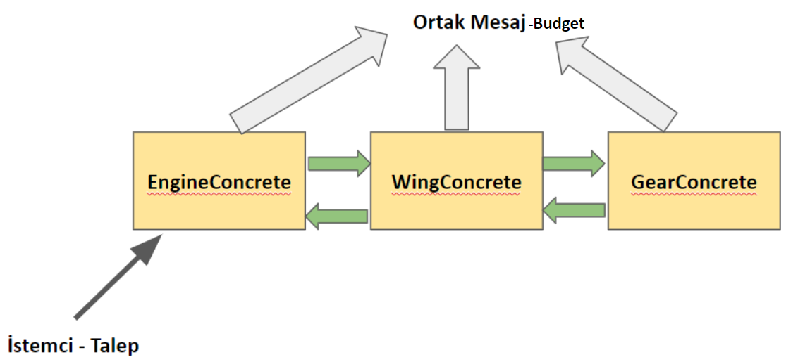
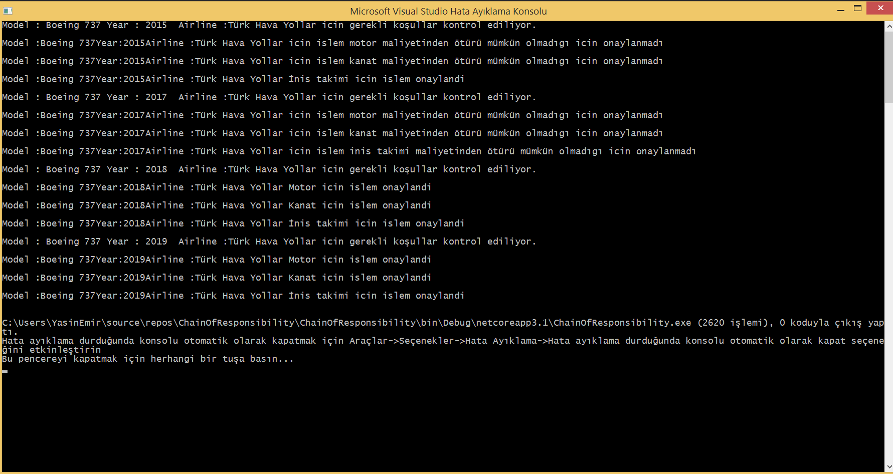

= Chain of Responsiblity Pattern 150202040 Yasin Emir Kutlu

== Chain of Responsibility Tasarım Deseni
*Chain of Responsibility Nedir ?:* Davranışsal tasarım kalıbı sınıfa üye bir tasarım kalıbıdır. Sorumluluk zinciri tasarım örüntüsü bir amaca yönelik bir dizi işlemi birden fazla sınıf aracılığıyla sınıfların birbirlerinden bağımsız şekilde çalışabilmesini sağlayan tasarım desenidir. Nesneler çalışma yapısı olarak aynı görevde olmasına rağmen birbirlerinin işlerinden çokta haberdar olmama durumunu temel alır(Gevşek bağlı).

*Chain of Responsibility Neden Kullanılır ? :* Sisteme gönderilen bir isteğin hangi sınıf tarafından işleneceğini bilmediğimiz veya işlem sırasında nesneler arası sıkı sıkıya bir bağlantıyı engellemek istenilen durumlarda kullanılır.

*Chain of Responsibility Nasıl Kullanılır ? :* Tüm nesnelerin anlayabileceği ortak bir mesaj yapısı vardır. Bu mesaj nesneler arası bağlantıyı kurarak zincir yapısının oluşmasını sağlamaktadır (Akış vardır). Bütün nesneler bu mesaj yapısını işleyerek görevlerini yerine getirirler.İstemci talebini zincirin en başındaki sınıfa iletir ve zincir içerisinde bu talep işlenir.

*Chain of Responsibility Kullanmanın Avantajları Nelerdir ? :* Nesneler arası gevşek bağlantı sağlanarak yazılmış olan kodun esnek, genişleyebilir, ilerleyen zamanlarda yeni özellikler eklenebilir bir yapıya kavuşmasını sağlamaktadır. Örneğin, eklenecek yeni bir modül önceki kodda büyük değişiklikler yapılmadan entegre edilebilir.

== CoR UML Diyagramı

[plantuml,ChainOfResponsibility,png]
----
class PlaneMessage 
{
 + string Model
 + string Year
 + string Airline
 + int Budget
 + PlaneMessage(model, year, airline, budget : string, string,string, int)
}
abstract class Producer 
{
 # Producer producer
 + BuildChain (producer : Producer) : void
 + abstract MakeDemand (message: PlaneMessage) : void
}
class Program
{
 + Produce engineProducer 
 + Produce gearProducer
 + Produce wingProducer
 + {static} Main() : void
}
class EngineConcrete
{
}
class WingConcrete
{
}
class GearConcrete
{
}

Producer <|.down. GearConcrete : <<extends>>
Producer <|.down. EngineConcrete : <<extends>>
Producer <|.down. WingConcrete : <<extends>>
Program -right- Producer : <<request>>
Producer .right.> PlaneMessage : <<use>>
----

=== Kod Açıklaması

[source,C#]
----
//PlaneMessage.cs
public class PlaneMessage <1>
    {
        public string Model { get; set; }
        public string Year { get; set; }
        public string Airline { get; set; }
        public int Budget { get; set; }

        public PlaneMessage(string model, string year,string airline,int budget)
        {
            Model = model;
            Year = year;
            Airline = airline;
            Budget = budget;

            Console.WriteLine("Model : " + model + " " + "Year : " + year + " "+ " Airline :" + airline + " " + "icin gerekli koşullar kontrol ediliyor.\n");
        }
    }
    
//Producer.cs
 abstract class Producer <2>
    {
        protected Producer producer;
        public void BuildChain (Producer producer) <3>
        {
            this.producer = producer;
        }

        public abstract void MakeDemand(PlaneMessage message);

    }
    
//EngineConcrete.cs
class EngineConcrete : Producer <4>
    {
        public override void MakeDemand(PlaneMessage message)
        {
            if (message.Budget >= 10000)
            {
                Console.WriteLine("Model :" + message.Model + "Year:" + message.Year + "Airline :" + message.Airline + " " + "Motor icin islem onaylandi\n");
                producer.MakeDemand(message); <5>
            }
            else if(producer != null)
            {
                Console.WriteLine("Model :" + message.Model + "Year:" + message.Year + "Airline :" + message.Airline + " " + "icin islem motor maliyetinden ötürü mümkün olmadıgı icin onaylanmadı\n");
                producer.MakeDemand(message);
            }
          
        }
    }
//WingConcrete.cs
class WingConcrete : Producer 
    {
        public override void MakeDemand(PlaneMessage message)
        {
            if(message.Budget >= 15000)
            {
                 Console.WriteLine("Model :" + message.Model + "Year:" + message.Year + "Airline :" + message.Airline + " " + "Kanat icin islem onaylandi\n"); 
                 producer.MakeDemand(message);
            }
            else if (producer != null)
            {
                Console.WriteLine("Model :" + message.Model + "Year:" + message.Year + "Airline :" + message.Airline +  " " +"icin islem kanat maliyetinden ötürü mümkün olmadıgı icin onaylanmadı\n");
                producer.MakeDemand(message);
            }

        }
    }
//GearConcrete.cs 
class GearConcrete : Producer 
    {
        public override void MakeDemand(PlaneMessage message)
        {
            if (message.Budget >= 3000)
            {
                Console.WriteLine("Model :" + message.Model + "Year:" + message.Year + "Airline :" + message.Airline + " " + "İnis takimi icin islem onaylandi\n");
            }
            else
            {
                Console.WriteLine("Model :" + message.Model + "Year:" + message.Year + "Airline :" + message.Airline + " " + "icin islem inis takimi maliyetinden ötürü mümkün olmadıgı icin onaylanmadı\n");
            }
        }
    }
    
//Program.cs
class Program
    {
        public static void Main(string[] args)
        {
            Producer engineProducer = new EngineConcrete();
            Producer gearProducer = new GearConcrete();
            Producer wingProducer = new WingConcrete();
 
            engineProducer.BuildChain(wingProducer); <6>
            wingProducer.BuildChain(gearProducer);

            PlaneMessage planeMessage = new PlaneMessage("Boeing 737", "2015", "Türk Hava Yollar",8000);
            engineProducer.MakeDemand(planeMessage);

            planeMessage = new PlaneMessage("Boeing 737", "2017", "Türk Hava Yollar", 1000);
            engineProducer.MakeDemand(planeMessage);

            planeMessage = new PlaneMessage("Boeing 737", "2018", "Türk Hava Yollar", 50000);
            engineProducer.MakeDemand(planeMessage);

            planeMessage = new PlaneMessage("Boeing 737", "2019", "Türk Hava Yollar", 20000);
            engineProducer.MakeDemand(planeMessage);

        }
    }
----

<1> Concrete sınıfların anlayabileceği ortak mesaj olan PlaneMessage sınıfının tanımlanması.
<2> Concrete sınıfları türetecek abstract class olan Producer (Parent) sınıfının tanımlanması.
<3> Sorumluluk zincirinin oluşmasında kullanılan methodun oluşturulması. 
<4> Producer sınıfından kalıtılmış ve sorumluluklarını birbirinden soyut şekilde yapan sınıfların kalıtım yoluyla oluşturulması.
<5> Alınan ortak mesajın işlendikten sonra zincirin bir sonraki halkasına verilmesinin sağlanması.
<6> Sorumluluk zincirinin kurulması. İlk halkanın engineProducer, ikinci halkanın wingProcuder, ücüncü halkanın gearProducer olarak belirlenmesi.

=== Ekran Çıktısı

=== Ekran Çıktısının Yorumlanması

Chain of Responsibility design pattern uygulamasında örnek senaryo olarak bir uçak üretim tesisi canlandırılmıştır. Bu yapı ile sınıfların işlemleri birbirlerinden soyutlanmıştır. Burada bir hava yolundan gelen istek zincir içerisinde bulunan sırasıyla engine, wing ve gear sınıflarına iletilerek işlenir. Zincir içerisindeki halkalar alınan ortak mesajı işleyerek birbirlerine iletir ve işlenen mesaj istemciye döndürülür. Buradaki senaryo da zincirin ilk halkası havayolu bütçesine göre motor işlemine onay versede istek diğer birimlere de iletir ve en sonunda sonuç ekrana bastırılır. Konsol ekranında Türk Hava Yollarının farklı bütçelerde yapmış olduğu ekipman isteğinin bütçeye göre değerlendirilip sonuçlarının bastırıldığı görülmektedir. 
