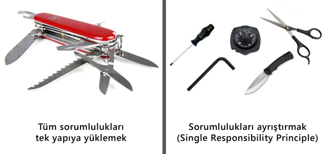
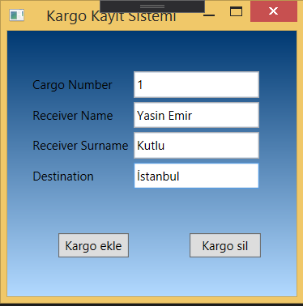
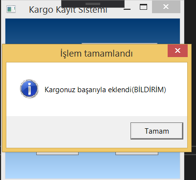
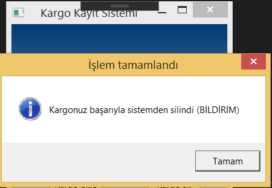

= Single Responsbility 150202040 Yasin Emir Kutlu

== Single Responsibility

*Single Responsibility Nedir ? :* SOLID prensipleri arasındaki 'S' prensibini temsil etmektedir. Tek sorumluluk prensibi anlamına gelmektedir. Temelde, projenizdeki bir sınıfın veya fonksiyonun sadece ve sadece tek bir sorumluluğu yerine getirmesi gerektiğini söyler. 

*Single Responsibility Nasıl Kullanılır ? :* Bir sınıfta sadece ve sadece o sınıfa ait sorumluluklar bulunmalıdır. Örneğin bahcivan.cs sınıfı içerisinde BudamaYap(), SulamaYap() gibi methodlar bulunabilirken, YemekYap() gibi bir method bu sınıf içerisinde olmamalıdır. Sorumlulukların ait olduğu sınıflara koyularak her sınıfın kendi sorumluluğundaki işleri yapması sağlanır ve Single Responsiblity prensibi gerçeklenmiş olur.

*Single Responsibility Neden Kullanılır ? :* Üzerinde çalıştığımız projenin genişletilebilir olması, yapılacak bir değişikliğin farklı yerleri etkilememesi, kolay okunabilir kodlar yazılması ve bileşenler arası bağımlılığın azaltılabilmesi için SOLID prensipleri kullanılır. Single Responsibility prensibinin amacı da bir sınıfın veya bir fonksiyonun sadece ve sadece tek bir sorumluluğa sahip olmasını sağlamaktır. 

*Single Responsbility Kullanmanın Avantajları Nelerdir ? :* Kodun okunabilirliğini arttırır. Bağımlılığı azaltır (Reduced Coupling). Kod karmaşıklığını azaltır. Yazılmış olan koda genişletilebilirlik ve yönetim kolaylığı sağlar. Tekrardan kullanılabilirlik (Reusability) kavramını gerçekler. Yani fonksiyonlar ayrıştırıldığı için kod içerisinde başka bir yerde o fonksiyona ihtiyaç duyulursa yeniden yazmadan kullanılabilir.

== Single Responsibility UML Diyagramı

[plantuml,SingleResponsibility,png]

----
class Cargo
{
+ int CargoNumber
+ string ReceiverName
+ string ReceiverSurname
+ string Destination
}

class CargoIssues
{
+ {static} List<Cargo> cargos
- {static} object readonly locked 
+ Registration (cargo : Cargo) : void
+ Deletion (cargo : Cargo) : void
}

class Notify
{
+ SendRegistrationNotification()
+ SendDeletionNotification()
}

class MainWindow
{
+ Cargo cargo
+ CargoIssues cargoIssues
+ Notify notify
- AddButon_Click(sender , e : object , RoutedEventArgs)
- DeleteButon_Click(sender , e : object , RoutedEventArgs)
+ MainWindow()
}

CargoIssues -left- MainWindow 
Notify -right- MainWindow
CargoIssues ..> Cargo : <<use>>

----

== Kod Açıklaması

[source,C#]
----
//Cargo.cs 
public class Cargo
    {
        public int CargoNumber { get; set; }
        public string ReceiverName { get; set; }
        public string ReceiverSurname { get; set; }
        public string Destination { get; set; }
    }
    
//CargoIssues.cs
public class CargoIssues
    {
        public static List<Cargo> cargos = new List<Cargo>();
        private static readonly object locked = new object();
        public void Registration (Cargo cargo) <1>
        {
            lock(locked) cargos.Add(cargo);
        }

        public void Deletion (Cargo cargo)
        {
            lock (locked) cargos.Remove(cargo);
        } 

    }
    
// Notify.cs
public class Notify
    {
        public void SendRegistrationNotification() <2>
        {
            MessageBox.Show("Kargonuz başarıyla eklendi(BİLDİRİM)", "İşlem tamamlandı", MessageBoxButton.OK, MessageBoxImage.Information);
        }

        public void SendDeletionNotification()
        {
            MessageBox.Show("Kargonuz başarıyla sistemden silindi (BİLDİRİM)", "İşlem tamamlandı", MessageBoxButton.OK, MessageBoxImage.Information);
        }
    }
//MainWindow.cs
public partial class MainWindow : Window
    {
        public MainWindow()
        {
            InitializeComponent();

        }
        Cargo cargo = new Cargo();
        CargoIssues cargoIssues = new CargoIssues(); <3>
        Notify notify = new Notify(); <4>

        private void AddButon_Click(object sender, RoutedEventArgs e)
        {
            cargo.CargoNumber = Int32.Parse(txtCargoNumber.Text);
            cargo.ReceiverName = txtReceiverName.Text;
            cargo.ReceiverSurname = txtReceiverSurname.Text;
            cargo.Destination = txtDestination.Text;
            cargoIssues.Registration(cargo); <5>
            notify.SendRegistrationNotification(); <6>
        }

        private void DeleteButon_Click(object sender, RoutedEventArgs e)
        {
            cargo.CargoNumber = Int32.Parse(txtCargoNumber.Text);
            cargo.ReceiverName = txtReceiverName.Text;
            cargo.ReceiverSurname = txtReceiverSurname.Text;
            cargo.Destination = txtDestination.Text;
            cargoIssues.Deletion(cargo);
            notify.SendDeletionNotification();
        }
    }

----

<1> CargoIssues sınıfının sorumluluğundaki görevlerin atanması
<2> Notify sınıfının sorumluluğundaki görevlerin belirlenmesi
<3> CargoIssues sınıfına ait olan sorumlulukların yerine getirilebilmesi için CargoIssues tipli nesnenin tanımlanması
<4> Notify sınıfına ait olan sorumlulukların yerine getirilebilmesi için Notify tipindeki nesnenin tanımlanması
<5> CargoIssues sınıfının görevini yapması
<6> Notify sınıfının görevini yapması

== Ekran Çıktısı
GUI : 

Bildirim ekranları : 

== Ekran Çıktısının Yorumlanması

Single Responsibility için örnek senaryo bir kargo şirketinin varolan sistemlerine kargo ekleme işlemini canlandırmaktadır. Single Responsibility prensibine göre dizayn edilmiş olan kodda Kargo işlemlerinin (Ekleme Silme) CargoIssues.cs sınıfında, kargo girildiğinde kargocuyu bilgilendirme methodununda Notify.cs sınıfına ayrıştırılarak Single Responsibility prensibi sağlanmıştır. Her method kendi ile alakalı sadece ve sadece bir iş yapmaktadır. Ekran çıktısında da masaüstü uygulmasındaki bildirim ve kargo işlemleri görünmektedir.